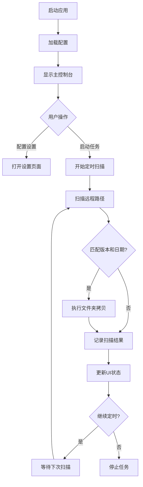

## 1. 产品概述

这是一个Windows桌面文件同步工具，用于自动监控和拷贝远程共享目录中的特定版本文件夹到本地指定路径。工具支持定时扫描、版本过滤、状态监控等功能，为开发团队提供自动化的版本文件获取解决方案。

目标用户：需要在Windows环境下自动获取远程版本文件的开发、测试人员。通过自动化拷贝减少手动操作，提高工作效率。

## 2. 核心功能

### 2.1 用户角色
本工具为单用户桌面应用，无需区分用户角色。

### 2.2 功能模块
文件同步工具包含以下核心页面：

1. **主控制台页面**：配置管理、任务状态、日志显示
2. **设置页面**：远程路径配置、版本规则设置、定时任务配置

### 2.3 页面详情

| 页面名称 | 模块名称 | 功能描述 |
|---------|---------|---------|
| 主控制台 | 任务状态区 | 显示当前任务执行状态（运行中/停止）、下次执行时间、上次执行结果 |
| 主控制台 | 日志显示区 | 实时显示任务执行日志，包括扫描结果、拷贝操作、错误信息 |
| 主控制台 | 快速操作区 | 启动/停止定时任务、立即执行一次扫描、清空日志 |
| 设置页面 | 远程路径配置 | 添加/编辑/删除多个远程UNC路径（如\\\\nt03\\iCPD\\AUTOCOMPILE\\VMS\\V200R001B01\\） |
| 设置页面 | 版本规则设置 | 设置需要监控的版本号列表（如1.3.7.P18、1.3.7.P18.L03） |
| 设置页面 | 定时任务配置 | 设置扫描间隔时间（5分钟、10分钟、30分钟、自定义） |
| 设置页面 | 本地路径配置 | 设置本地目标路径（默认E:\\UMS_TEMP\\） |

## 3. 核心流程

### 主流程
1. 用户配置远程路径、版本规则和扫描间隔
2. 启动定时任务，后台开始周期性扫描
3. 每次扫描时检查所有配置的远程路径
4. 匹配文件夹名称格式：YYYY_MM_DD_HH_MM(Version)
5. 筛选符合指定版本且日期为当天或昨天的文件夹
6. 将匹配的文件夹拷贝到本地E:\\UMS_TEMP\\Version\\目录
7. 更新日志和状态显示

## 4. 用户界面设计

### 4.1 设计风格
- **主色调**：深蓝色（#1E40AF）配合灰色（#6B7280）
- **按钮样式**：圆角矩形，主要操作为蓝色，危险操作为红色
- **字体**：系统默认字体，标题14px，正文12px
- **布局风格**：左侧导航栏 + 右侧内容区的经典桌面应用布局
- **图标风格**：使用简洁的线性图标，符合Windows设计规范

### 4.2 页面设计概述

| 页面名称 | 模块名称 | UI元素 |
|---------|---------|---------|
| 主控制台 | 状态卡片 | 蓝色卡片显示任务状态，包含运行图标、状态文本、下次执行时间倒计时 |
| 主控制台 | 日志区域 | 深色背景的滚动文本框，按时间戳显示日志，支持复制和清空 |
| 主控制台 | 操作按钮 | 绿色启动按钮、红色停止按钮、蓝色立即执行按钮 |
| 设置页面 | 路径列表 | 表格形式显示远程路径，支持添加、编辑、删除操作 |
| 设置页面 | 版本输入 | 标签输入框，支持输入多个版本号 |
| 设置页面 | 时间选择 | 下拉选择框提供预设时间间隔，或自定义输入框 |

### 4.3 响应式设计
桌面优先设计，固定窗口大小（1000x700px），针对Windows桌面环境优化。

### 4.4 系统托盘集成
应用支持最小化到系统托盘，托盘图标显示当前任务状态（运行/停止），右键菜单提供快速操作。