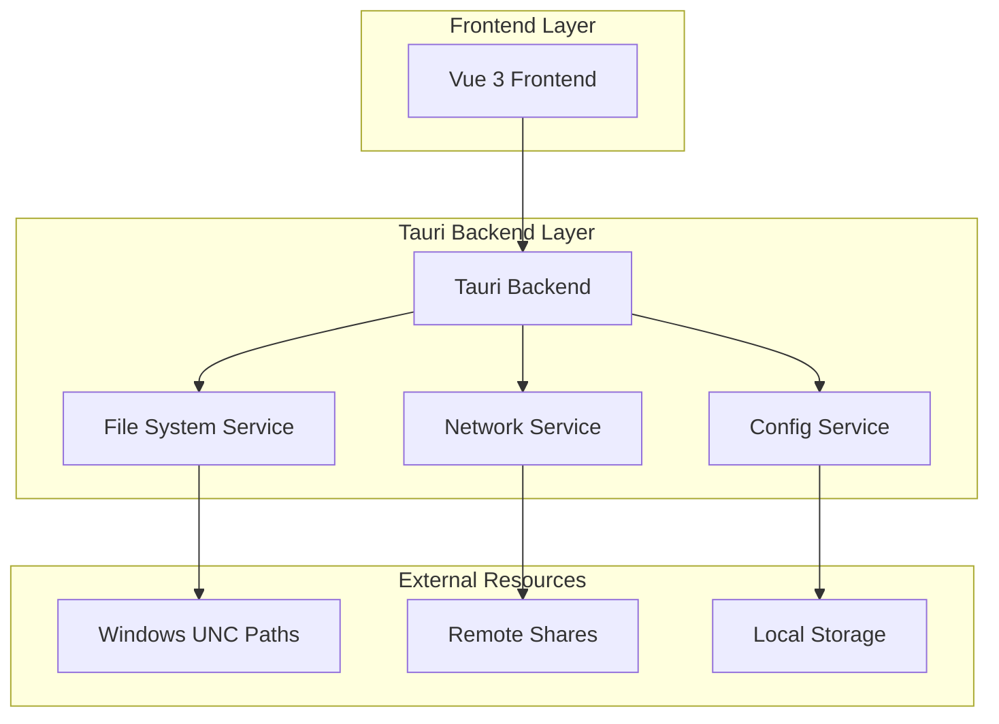
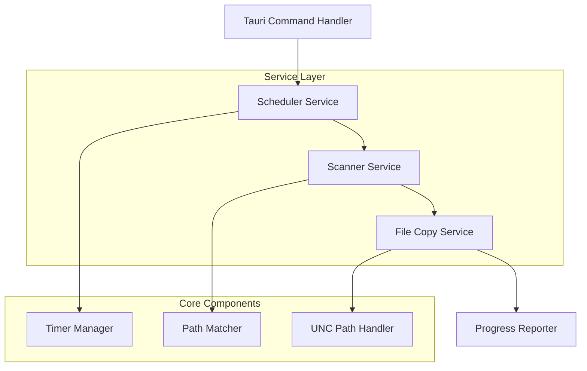

## 1. 架构设计



## 2. 技术选型说明

### 为什么选择 Rust + Tauri 而非 Go

**Rust + Tauri 优势：**

1. **原生性能**：Rust的系统级性能，适合大量文件IO操作
2. **小体积**：Tauri打包后exe文件通常小于10MB，远小于Go的50MB+
3. **内存安全**：Rust的内存安全机制避免运行时错误
4. **WebView2集成**：直接利用Windows内置的WebView2，无需额外运行时
5. **前端技术栈**：完美支持Vue 3，开发效率高

**Go方案劣势：**

1. 需要额外的WebView库（如Lorca、WebView），增加复杂度
2. 最终打包体积较大
3. GUI开发体验不如Web技术成熟

### 前端技术栈

* **Vue 3 + Composition API**：现代化的响应式框架，适合复杂状态管理

* **Tailwind CSS 4**：最新的原子化CSS框架，快速构建美观界面

* **Vite**：快速的构建工具，开发体验优秀

* **pnpm**：高效的包管理器，节省磁盘空间

## 3. 技术描述

* **前端**：Vue 3\@latest + Tailwind CSS 4\@latest + Vite\@latest

* **初始化工具**：vite-init

* **后端**：Rust + Tauri\@latest

* **构建工具**：pnpm + cargo

* **目标平台**：Windows 10/11 (x64)

## 4. 路由定义

| 路由        | 用途                |
| --------- | ----------------- |
| /         | 主控制台页面，显示任务状态和日志  |
| /settings | 设置页面，配置远程路径、版本规则等 |

## 5. 核心API定义

### 5.1 Tauri 命令接口

**启动定时任务**

```rust
#[tauri::command]
async fn start_scheduler(interval_minutes: u32, config: Config) -> Result<(), String>
```

**停止定时任务**

```rust
#[tauri::command]
async fn stop_scheduler() -> Result<(), String>
```

**立即执行扫描**

```rust
#[tauri::command]
async fn scan_now(config: Config) -> Result<ScanResult, String>
```

**获取任务状态**

```rust
#[tauri::command]
async fn get_status() -> Result<TaskStatus, String>
```

### 5.2 数据结构定义

```typescript
interface Config {
  remotePaths: string[];
  targetVersions: string[];
  localPath: string;
  intervalMinutes: number;
}

interface ScanResult {
  timestamp: string;
  scannedPaths: number;
  foundFolders: FoundFolder[];
  copiedFolders: CopiedFolder[];
  errors: string[];
}

interface FoundFolder {
  path: string;
  name: string;
  version: string;
  date: string;
  matchCriteria: boolean;
}

interface TaskStatus {
  isRunning: boolean;
  nextExecutionTime?: string;
  lastExecutionTime?: string;
  lastResult?: ScanResult;
}
```

## 6. 后端架构设计



## 7. 数据模型

### 7.1 配置文件结构

```json
{
  "remote_paths": [
    "\\\\nt03\\iCPD\\AUTOCOMPILE\\VMS\\V200R001B01\\",
    "\\\\nt04\\iCPD\\AUTOCOMPILE\\VMS\\V200R001B01\\"
  ],
  "target_versions": ["1.3.7.P18", "1.3.7.P18.L03"],
  "local_base_path": "E:\\UMS_TEMP\\",
  "scan_interval_minutes": 10,
  "auto_start": false,
  "max_log_entries": 1000
}
```

### 7.2 日志数据结构

```rust
struct LogEntry {
    timestamp: String,
    level: LogLevel,
    message: String,
    context: Option<HashMap<String, String>>,
}

enum LogLevel {
    Info,
    Warning,
    Error,
    Success,
}
```

## 8. 关键技术实现

### 8.1 Windows UNC路径处理

* 使用Windows API进行网络路径访问

* 支持网络凭据配置（如需要）

* 处理网络连接超时和重试机制

### 8.2 文件夹名称解析

```rust
fn parse_folder_name(name: &str) -> Option<(String, String)> {
    // 解析格式：2025_11_05_18_03(1.3.7.P18)
    let re = Regex::new(r"^(\d{4}_\d{2}_\d{2}_\d{2}_\d{2})\\(([^)]+)\\)$").unwrap();
    re.captures(name).and_then(|cap| {
        let date_part = cap.get(1)?.as_str().to_string();
        let version_part = cap.get(2)?.as_str().to_string();
        Some((date_part, version_part))
    })
}
```

### 8.3 异步文件拷贝

* 使用tokio::fs进行异步文件操作

* 实现进度回调，实时更新拷贝状态

* 支持大文件分块拷贝，避免内存溢出

### 8.4 定时任务调度

* 使用tokio-cron或自定义定时器

* 支持动态修改扫描间隔

* 任务状态持久化，应用重启后恢复

## 9. 性能优化策略

1. **增量扫描**：记录已扫描的文件夹，避免重复扫描
2. **并发处理**：同时扫描多个远程路径
3. **内存管理**：流式拷贝大文件，控制内存使用
4. **网络优化**：设置合理的超时时间和重试机制
5. **日志轮转**：自动清理过期日志，避免日志文件过大

## 10. 错误处理和监控

* **网络错误**：处理UNC路径不可访问、权限不足等问题

* **文件系统错误**：处理磁盘空间不足、文件被占用等情况

* **配置错误**：验证配置格式，提供友好的错误提示

* **运行时监控**：记录关键指标，便于问题排查

## 11. 打包和部署

* **单文件exe**：Tauri打包生成独立的可执行文件

* **安装包**：可选创建MSI安装包，支持桌面快捷方式

* **自动更新**：集成Tauri的更新机制，支持在线更新

* **系统托盘**：最小化到系统托盘，后台运行

