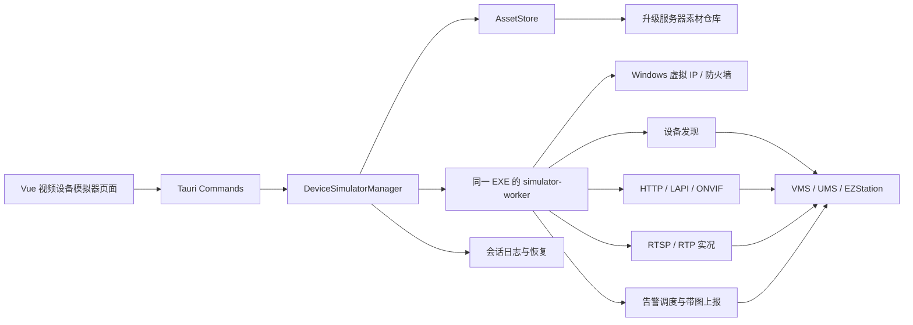

# 视频设备模拟器设计规格

- **日期**：2026-07-18
- **状态**：首版范围已批准；本地通用基础设施已实现，签名素材、隔离 Windows VM 与真实平台验收待完成
- **目标项目**：`D:\WorkSpace\File-Sync-Tool`
- **旧实现参考项目**：`D:\WorkSpace\VirtualTools`
- **目标平台**：Windows
- **技术方向**：Vue 3 + Tauri 2 + Rust/Tokio，全量重写协议引擎

---

## 1. 文档目的

本文档定义 File Sync Tool 新增“视频设备模拟器”功能的业务边界、事实来源、总体架构、Rust Worker、虚拟 IP、设备协议、RTSP 实况、带图告警、素材下载、配置、状态机、接口、测试和验收要求。

本文档是后续实现窗口的设计依据，不是对旧项目源码的逐行翻译。实现应保持所选业务能力与旧项目一致，同时用更安全、更高性能、更适合当前项目的方式重新实现。

## 2. 最重要的事实来源与禁止猜测规则

### 2.1 强制规则

实现过程中，凡是遇到以下任一情况不清楚，必须停止当前细节实现并到旧项目 `D:\WorkSpace\VirtualTools` 查证：

- 设备型号、版本、昵称、设备类型枚举、序列号或硬件 ID 格式。
- 某种 IPC/NVR 支持哪些平台。
- HTTP、LAPI、ONVIF、WS-Discovery 的路径、方法、请求识别方式和响应内容。
- RTSP URL、SDP、Payload Type、编码格式、主辅码流路径或 NVR 通道路径。
- 告警类型、开始/恢复事件、上报 URL、Content-Type、JSON/XML 字段、图片数量和图片字段。
- 平台订阅、注册、保活、鉴权、用户名密码、端口或主从模式行为。
- 模板中的动态替换字段及其来源。
- 旧工具界面某个选项真正对应的运行行为。
- VMS、UMS、EZStation、EZAccess 之间的差异。

不得采用以下做法：

- 根据字段名猜测协议含义。
- 根据通用 ONVIF 或 RTSP 经验擅自补全厂商协议。
- 用“通常应该如此”代替旧源码或实际平台证据。
- 为了让测试通过而伪造旧项目不存在的响应字段。
- 遇到旧代码不一致时自行选择看起来更合理的一支。
- 在没有证据时宣称已兼容某个平台、设备类型或告警类型。
- 把旧项目 README 当作比源码、模板和实际报文更高优先级的协议真相。

如果查阅旧项目后仍无法确定，应将问题记录为“待业务确认”，列出已检查的文件、相互冲突的证据和可能影响，然后请求用户决定。不得静默决定。

### 2.2 事实优先级

发生冲突时，按以下顺序处理：

1. 用户在本 Spec 审查后明确批准的业务决策。
2. 目标平台实际请求、响应、抓包和验收结果。
3. 旧项目当前可工作的源码、模板及配置组合。
4. 旧项目 `README.md` 和操作手册。
5. 旧项目版本记录。
6. 通用协议规范和开发者经验。

通用协议规范可以用于检查明显错误，但不得覆盖已经确认的厂商兼容行为。若旧行为违反规范却是目标平台兼容所必需，应记录兼容原因并通过 profile 隔离。

### 2.3 旧项目查阅导航

后续实现至少应按下表查阅，不得只读 README：

| 主题 | 首要参考位置 |
| --- | --- |
| 总体功能、运行方式、限制 | `D:\WorkSpace\VirtualTools\README.md` |
| 程序入口、启动停止、设备参数生成、告警进程编排 | `script\VSITool.py` |
| 虚拟 IP、设备发现、设备 HTTP/RTSP 启动 | `script\Vsocket_ip.py` |
| HTTP/LAPI/ONVIF 请求路由和模板替换 | `script\HTTPServer.py` |
| RTSP/SDP/RTP 行为 | `script\IPCRtspLib.py`、`IPCSubRtspLib.py`、`IPCThirdRtspLib.py` |
| 告警任务编排和设备类型分发 | `script\Vsocket_pic.py` |
| 具体告警报文构造 | `script\*Alarm.py` |
| 设备类型、型号、版本、平台支持 | `data\dev_type.yml` |
| 告警类型、模板、图片映射和平台支持 | `data\alarms_info.yml` |
| HTTP/XML/ONVIF 响应模板 | `xml\` |
| 告警 JSON 结构 | `object\` |
| 告警图片 | `pic\` |
| 旧 RTSP 抓包素材 | `mediafile\` |
| 旧配置字段和默认值 | `config\VSIConfig.ini`、`config\advance_config.yml` |
| 版本变化和历史兼容信息 | `版本信息.txt` |

### 2.4 查阅安全要求

- 默认只进行静态阅读，不直接运行 `VSITool.exe`。
- 不执行会修改网卡、添加大量 IP、开放防火墙或向真实平台发送告警的旧代码，除非用户明确授权并提供隔离测试环境。
- 旧配置可能包含明文测试凭据；不得复制到新代码、测试、日志、文档或提交记录。
- 旧源码带有版权声明且没有独立许可证文件；正式复用模板、图片、PCAP 或代码前必须确认组织内部授权。
- 新实现可以提取业务事实，但不得无审查地复制旧项目的动态执行、强杀进程、WMI 整体改网卡等实现。

### 2.5 实现证据要求

每迁移一个设备 profile 或告警 handler，应在代码或对应测试夹具附近记录来源，至少包括：

- 旧项目参考文件。
- 对应设备类型或告警类型名称。
- 使用的模板相对路径。
- 已验证的目标平台。
- 与旧项目相比有意改变的实现行为。

不要求在产品日志中暴露这些内部路径，但实现审查时必须能够追溯。

---

## 3. 背景

File Sync Tool 当前是 Windows 桌面工具箱，采用 Tauri 2、Vue 3、TypeScript、Tailwind CSS 4 和 Rust。新功能需要把 VirtualTools 中与 IPC/NVR 设备模拟相关的一部分业务能力整合到当前工具内部。

目标能力为：

1. 按配置生成指定数量的 IPC 和 NVR 虚拟设备。
2. 提供稳定的 RTSP 实况流，供外部平台拉流并由平台自行录像。
3. 向目标平台上报告警，支持携带图片。

旧工具使用 Python/PyQt5、多进程、多线程、WMI、Scapy、PCAP 重放和大量 XML/JSON/图片模板。新实现不保留 Python 协议引擎，而使用 Rust/Tokio 重写，并通过外部素材仓库下载协议数据和媒体素材。

---

## 4. 已确认决策

### 4.1 产品名称

界面名称使用“视频设备模拟器”，避免“虚拟设备模拟”的语义重复，也避免用户误以为这是虚拟机管理功能。

内部模块名使用：

```text
device_simulator
```

路由建议使用：

```text
/tools/device-simulator
```

### 4.2 技术选型

- 协议引擎使用 Rust/Tokio 全量重写。
- 不嵌入 Python 解释器。
- 不打包或执行旧 Python 脚本。
- 不从升级服务器下载可执行代码。
- 同一主 EXE 支持隐藏的 `simulator-worker` 运行模式，实现故障和权限隔离。
- Vue 页面只通过 Tauri commands 与主进程交互，不直接访问 Worker。

### 4.3 Phase 1 范围与安全决策

- 首版目标平台限定为 VMS/UMS，交付 `ipc-custom`、`ipc-smart`、`nvr-common`、`nvr-vehicle` 四个独立 Profile。
- NVR 默认 8 通道、产品安全上限 128；128 来自旧固定 Profile 素材覆盖边界，不表示厂商协议上限。
- 首版模拟设备入站鉴权和 RTSP Digest 关闭；RTSP 只接受 TCP interleaved；主、辅、第三码流可用但媒体按客户端惰性调度；不声明实况音频。
- Catalog 强制 Ed25519 离线签名；素材服务器首版不保存或发送应用层凭据。
- 防火墙默认由提权 Worker 精确管理，启动前显式确认，只清理由 journal 证明归本会话所有的规则。
- 自定义图片独立内容寻址存储；旧模板、图片和 PCAP 允许用于测试、学习、复制和打包，但禁止商用，生成物必须保留该限制。
- 正式功能版本为 1.2.1，首批正式素材 Pack 版本为 1.0.2，素材 schema 与 engine API 首版均为 1。

完整证据、冲突和验收值以 `2026-07-18-video-device-simulator-evidence-matrix.md` 为准。

### 4.4 回放边界

“存回放”定义为：平台拉取模拟器的 RTSP 实况流后，自行录像、索引和回放。

模拟器不负责：

- 保存录像文件。
- 提供录像列表或时间轴。
- 提供 RTSP 回放 URL。
- 模拟录像检索、下载和回放控制。

旧工具中的“实况/回放二选一”不迁移为产品功能。旧 `mainplayback.pcap` 仅作为兼容研究或可选归档素材，不属于首版运行必需资产。

### 4.5 素材发布边界

以下内容全部不进入应用发布 EXE：

- XML/JSON 等协议响应和告警模板。
- 设备 profile 数据。
- 告警图片。
- RTSP 视频/音频媒体素材。
- 从 PCAP 转换得到的媒体包。

第一次使用视频设备模拟器时，从当前升级服务器的独立素材目录下载。下载后缓存到应用数据目录，可离线复用。

Rust 协议处理器、状态机、解析器、校验器和 handler 枚举仍编译进应用 EXE。

---

## 5. 目标

1. 支持用一个或多个设备组配置指定数量的 IPC/NVR。
2. 为每台设备生成唯一且稳定的 IP、MAC、序列号和硬件 ID。
3. 安全地向用户选定的 Windows 网卡添加次要 IPv4 地址，不覆盖原网络配置。
4. 支持目标平台发现、添加并保持设备在线。
5. 支持所选 profile 对应的 HTTP、LAPI、ONVIF 和订阅行为。
6. 支持 RTSP over TCP 实况拉流，并满足平台连续录像需要。
7. 支持 IPC/NVR 通道和主、辅、第三码流 URL。
8. 支持固定、随机、顺序告警模式以及带图告警。
9. 支持单次触发、固定次数和持续发送。
10. 支持告警开始、告警恢复和成功/失败统计。
11. 支持素材首次下载、校验、安装、缓存、更新和回滚。
12. 支持崩溃后的虚拟 IP 和运行会话恢复清理。
13. 支持关闭到托盘后继续运行，实际退出时可靠停止并清理。
14. 所有面向用户的文案同时提供中文和英文。

## 6. 非目标

首版不包含：

1. 由模拟器保存和提供录像回放。
2. macOS 或 Linux 设备模拟。
3. SIP、VIID、SNMP、门禁、访客机、梯控、可视对讲或 Xware 等非 IPC/NVR 功能，除非后续单独批准。
4. 自动迁移旧工具的全部 22 类设备。
5. 从服务器下载并执行 Python、JavaScript、DLL、WASM 或其他可执行扩展代码。
6. 无证据的通用 ONVIF 全功能实现。
7. 生产网络中的异常参数、冲突 IP 或攻击测试。
8. 自动修改用户已有的固定 IP、默认网关或 DNS。
9. 让素材更新影响正在运行的模拟会话。

---

## 7. 首版设备 Profile 范围

首版目标 profile 为：

| Profile ID | 旧项目设备类型 | 目的 |
| --- | --- | --- |
| `ipc-custom` | 自定义报警相机 | IPC 上线、RTSP、带图自定义告警 |
| `ipc-smart` | 智能相机 | IPC 上线、RTSP、VMS/UMS 智能告警 |
| `nvr-common` | 普通NVR | 普通 NVR、多通道、常规通道/设备告警 |
| `nvr-vehicle` | 车辆识别NVR | NVR 带图车辆告警 |

这些名称代表迁移范围，不代表可以自行定义具体型号或协议字段。实现必须从 `data\dev_type.yml`、`data\alarms_info.yml`、相关 `*Alarm.py`、XML/JSON 模板中提取真实业务事实。

智能相机使用独立 profile，不得把多个旧设备类型的逻辑混合进 `ipc-custom`。首版目标平台限定为 VMS/UMS，EZStation 延后。

普通 NVR 的旧告警主要为不带图 JSON；带图 NVR 行为由车辆识别 NVR profile 提供。不得为普通 NVR 凭空增加旧项目不存在的图片告警。

---

## 8. 总体架构



### 8.1 主进程职责

- Tauri/Vue 生命周期。
- 配置加载与保存。
- 素材 catalog 获取、下载、校验和安装。
- Worker 启动、提权、握手、心跳和停止。
- 将 Worker 状态转换为 Tauri 事件。
- 维护工具侧边栏运行状态。
- 实际退出时等待 Worker 清理。

### 8.2 Worker 职责

- 获取管理员权限。
- 创建和删除本会话拥有的虚拟 IP。
- 创建和删除本会话拥有的防火墙规则。
- 启动设备发现、HTTP/LAPI/ONVIF、RTSP 和告警任务。
- 持有运行会话的协议状态。
- 定时上报状态、指标和结构化日志。
- 主进程管道断开时执行清理并退出。

### 8.3 素材仓库职责

- 提供不可变、版本化的 ZIP pack。
- 提供独立 `catalog-v1.json`。
- 提供 SHA-256、大小、依赖关系和兼容版本。
- 不提供可执行脚本。

---

## 9. 进程模型与 Worker 启动

### 9.1 启动模式

主 EXE 在进入 Tauri、WebView2 bootstrap 和单实例插件之前解析内部参数：

```text
file-sync-tool.exe --simulator-worker --pipe <pipe-name> --session <session-id>
```

检测到 `--simulator-worker` 后：

1. 不创建 Tauri 窗口。
2. 不创建托盘。
3. 不注册主应用单实例插件。
4. 不启动剪贴板、同步调度器和其他工具。
5. 只初始化 Worker 日志、命名管道客户端、素材读取器和协议运行时。

### 9.2 提权

添加次要 IP 和管理防火墙需要管理员权限。主界面进程不应因为设备模拟功能而永久以管理员身份运行。

推荐流程：

1. 主进程创建随机命名管道和会话 ID。
2. 管道设置为仅当前用户和 Administrators 可访问。
3. 通过 Windows `runas` 启动同一 EXE 的 Worker 模式。
4. 用户在 UAC 中确认。
5. Worker 连接命名管道并进行协议版本握手。
6. Worker 未在超时时间内连接时，主进程终止启动流程并报告明确错误。

不得把目标平台密码、素材服务器凭据或其他秘密放在 Worker 命令行参数中。

### 9.3 故障隔离

- Worker panic 或退出时，主进程保持运行并显示错误。
- 主进程不得在未确认系统状态的情况下自动无限重启 Worker。
- Worker 异常退出后，状态进入 `recovery_required`，先检查会话日志和系统 IP，再允许新会话。
- 主进程异常退出时，Worker 通过管道 EOF 触发停止。
- Worker 无法完成清理时，把未清理资源原子写入恢复日志。

---

## 10. Rust 模块建议

```text
src-tauri/src/device_simulator/
├── mod.rs
├── commands.rs
├── manager.rs
├── models.rs
├── errors.rs
├── events.rs
├── worker_entry.rs
├── worker_protocol.rs
├── session.rs
├── journal.rs
├── preflight.rs
├── metrics.rs
├── assets/
│   ├── mod.rs
│   ├── catalog.rs
│   ├── resolver.rs
│   ├── download.rs
│   ├── archive.rs
│   ├── cache.rs
│   └── validation.rs
├── windows/
│   ├── mod.rs
│   ├── elevation.rs
│   ├── interfaces.rs
│   ├── ip_alias.rs
│   ├── firewall.rs
│   └── named_pipe.rs
├── profiles/
│   ├── mod.rs
│   ├── registry.rs
│   ├── loader.rs
│   └── schema.rs
├── device/
│   ├── mod.rs
│   ├── identity.rs
│   ├── discovery.rs
│   ├── http.rs
│   ├── routing.rs
│   └── template.rs
├── rtsp/
│   ├── mod.rs
│   ├── server.rs
│   ├── session.rs
│   ├── request.rs
│   ├── response.rs
│   ├── sdp.rs
│   ├── media.rs
│   ├── rtp.rs
│   └── scheduler.rs
└── alarm/
    ├── mod.rs
    ├── scheduler.rs
    ├── handlers.rs
    ├── template.rs
    ├── image_cache.rs
    └── transport.rs
```

前端建议：

```text
src/pages/VideoDeviceSimulatorPage.vue
src/components/device-simulator/
src/composables/useDeviceSimulator.ts
src/lib/deviceSimulatorTypes.ts
```

所有 Tauri `invoke` 封装仍集中在 `src/lib/tauri.ts`。不得在页面中散落裸 `invoke()`。

---

## 11. 配置模型

### 11.1 持久化设置

建议在应用域配置中新增：

```rust
struct DeviceSimulatorSettings {
    asset_server_url_override: Option<String>,
    selected_interface_id: Option<String>,
    last_platform: Option<PlatformKind>,
    last_start_ip: Option<Ipv4Addr>,
    last_device_groups: Vec<DeviceGroupDraft>,
    last_http_port: u16,
    last_rtsp_ports: RtspPorts,
    auto_check_asset_updates: bool,
}
```

该字段属于应用域，必须同步修改：

- Rust `AppConfig`。
- Rust `AppDomainConfigPatch`。
- 默认值、规范化、校验和迁移。
- 前端 `AppConfig` 类型。
- `src/lib/configDomains.ts`。
- 配置域测试和 `configStore` 测试。

### 11.2 不持久化内容

以下内容默认不写入配置：

- 目标平台密码、Token 和临时凭据。
- Worker 管道名和握手信息。
- 当前 Worker PID。
- 当前 RTSP 客户端会话。
- 当前告警发送计数。
- 尚未完成的 `.part` 文件路径以外的下载瞬时状态。

若确有业务要求保存目标平台密码，必须先单独设计安全存储，不得直接沿用旧 INI 明文方式。

### 11.3 启动请求

```rust
struct SimulatorStartRequest {
    platform: TargetPlatformConfig,
    interface_id: String,
    start_ip: Ipv4Addr,
    subnet_prefix: u8,
    device_http_port: u16,
    rtsp_ports: RtspPorts,
    groups: Vec<DeviceGroupConfig>,
    stream: StreamRuntimeConfig,
}

struct DeviceGroupConfig {
    id: String,
    profile_id: String,
    count: u32,
    nvr_channel_count: Option<u16>,
}

struct RtspPorts {
    main: u16,
    sub: u16,
    third: u16,
}
```

默认 HTTP/RTSP 端口必须从旧项目配置和源码核实。当前已观察到旧工具常用 HTTP `81`，RTSP 主/辅/第三码流 `554/555/556`，实现前仍应确认所选 profile 是否存在例外。

### 11.4 目标平台配置

目标平台配置至少表达：

- 平台类型。
- 一个或多个服务器地址。
- 服务器端口。
- 运行期用户名和密码（如选定 profile 确实需要）。
- 告警接收/订阅信息。

字段是否必需及其含义必须从旧项目和目标平台查证。不得为所有 profile 强制添加旧实现不需要的账号字段。

---

## 12. 运行状态机

### 12.1 会话状态

```text
idle
  -> validating
  -> assets_required
  -> downloading_assets
  -> preflighting
  -> starting_worker
  -> adding_ips
  -> starting_services
  -> running
  -> stopping_alarms
  -> stopping_services
  -> removing_firewall
  -> removing_ips
  -> stopped
```

异常状态：

```text
failed
recovery_required
recovering
```

规则：

- 任一时刻最多存在一个活动模拟会话。
- `running` 前取消必须回滚所有已经创建的系统资源。
- `running` 中停止先停告警，再停发现/HTTP/RTSP，最后删防火墙和 IP。
- 清理失败不得假装进入 `stopped`，应进入 `recovery_required`。
- 新会话开始前必须处理上一次未关闭会话。

### 12.2 素材状态

```text
unknown
checking
missing
downloading
verifying
installing
ready
update_available
failed
```

### 12.3 告警任务状态

```text
idle
starting
running
stopping
completed
failed
```

每个告警任务拥有唯一 ID，可针对设备组、设备子集或单个设备运行。

---

## 13. Worker 通信协议

### 13.1 传输

- Windows 命名管道。
- 长度前缀 JSON 消息，避免日志或模板中的换行破坏消息边界。
- 每条请求包含 `request_id`。
- 每条响应回显 `request_id`。
- Worker 主动事件不需要请求 ID，但必须包含 `session_id` 和递增序号。

### 13.2 握手

```rust
struct WorkerHello {
    worker_protocol_version: u32,
    app_version: String,
    session_id: String,
    process_id: u32,
    elevated: bool,
}
```

主进程校验：

- Session ID 一致。
- Worker protocol version 兼容。
- Worker 处于管理员权限。
- 连接来自预期管道。

### 13.3 命令

```text
initialize_session
run_preflight
start_services
stop_services
start_alarm_job
stop_alarm_job
trigger_alarm_once
get_status
shutdown
recover_session
```

### 13.4 Worker 事件

```text
status_changed
service_ready
device_status
rtsp_client_changed
alarm_stats
log
cleanup_progress
fatal_error
```

### 13.5 心跳

- 主进程和 Worker 应互相检测存活。
- Worker 不能只依赖心跳超时判断主进程死亡；命名管道 EOF 是主要信号。
- 心跳用于识别阻塞或失去响应。
- 超时时间和重启策略应可测试，不允许无限等待。

---

## 14. 虚拟设备身份与地址分配

### 14.1 地址生成

输入为起始 IPv4、子网前缀和设备组数量，输出为连续设备列表。

必须校验：

- IPv4 格式和前缀范围。
- 网络地址和广播地址不可分配。
- 不越过所选子网，除非用户明确配置了多个网段并且实现支持。
- 不与本机已有地址重复。
- 不与本次其他设备重复。
- 分配范围数量足够。
- 所选网卡与目标网段关系合理。

旧项目跳过末段 `.255` 的行为不能直接当作所有前缀的通用规则；新实现必须按真实 CIDR 计算网络和广播地址。

### 14.2 MAC、序列号和硬件 ID

- 每台设备必须唯一。
- 同一启动请求在预览和真正启动之间应保持一致。
- 是否需要跨应用重启稳定，由 profile 和业务审查决定。
- 生成格式、长度、前缀和字符集必须从旧项目查证。
- 不得用随机 UUID 替代平台期望的厂商格式。

### 14.3 预览

启动前 UI 展示：

- 设备序号。
- Profile。
- IP。
- MAC。
- 序列号/硬件 ID。
- NVR 通道数。
- 预期 HTTP 地址。
- 预期 RTSP 地址摘要。

预览数据应由 Rust 后端生成，前端不得复制一份独立生成算法。

---

## 15. Windows 虚拟 IP 管理

### 15.1 实现原则

- 使用 Windows 原生 IP Helper 能力添加/删除次要地址。
- 不使用旧项目 WMI `EnableStatic` 整体重写网卡配置。
- 不修改原有主 IP、DHCP、网关和 DNS。
- 通过稳定的接口标识选择网卡，不依赖容易变化的显示名称。
- 只删除本会话实际创建的地址。

### 15.2 添加流程

1. 枚举网卡和现有地址。
2. 重新验证预览地址仍未被本机占用。
3. 对计划地址执行局域网冲突探测。
4. 在会话日志中记录“计划添加”。
5. 逐个添加次要地址。
6. 每成功一个立即记录“已拥有”。
7. 失败时回滚本次已添加地址。
8. 等待地址进入可用状态后再启动监听服务。

冲突检测不能只依赖 Ping，因为目标可能禁用 ICMP。应结合本机地址表、邻居/ARP 探测以及可用的冲突检测机制。无法确定时应提示风险，而不是宣称地址空闲。

### 15.3 删除流程

1. 从内存和会话日志读取本会话拥有的地址。
2. 查询系统当前地址表。
3. 只删除“会话拥有且系统仍存在”的地址。
4. 每删除一个更新日志。
5. 不根据起始 IP 和数量重新推导删除范围。

这条规则用于避免配置改变后误删用户地址。

---

## 16. 防火墙设计

模拟器需要接受目标平台访问设备 HTTP 和 RTSP 端口，并参与相关 UDP 发现协议。

要求：

- 启动前检查所需入站规则。
- 自动创建的规则必须带产品前缀和 Session ID。
- 尽可能限定到当前 EXE、协议、端口和本次虚拟地址。
- 记录由本会话创建的规则。
- 停止时只删除本会话创建的规则。
- 用户已有允许规则不得删除。
- 创建失败时必须明确报告，不得把“服务监听成功”等同于“局域网可访问”。

防火墙具体 API 和规则粒度需要在实现前通过 Windows 测试确认。若 API 行为不清楚，不得回退到静默执行 `netsh`；应查阅当前项目屏幕共享的既有经验和 Windows 官方接口，再形成可测试实现。

---

## 17. 设备发现与 HTTP/LAPI/ONVIF

### 17.1 发现服务

- 监听旧项目实际使用的发现组播地址和端口。
- 识别目标平台发送的 Probe。
- 为每台符合 profile 的虚拟设备从其虚拟 IP 发出响应。
- Message ID、RelatesTo、设备地址、MAC、硬件 ID、型号和版本替换规则从旧模板查证。
- 平台差异通过 profile 表达。

不得直接复制旧代码中宽泛的 `except: pass`。所有解析失败和发送失败必须计数并按限频方式记录。

### 17.2 HTTP 服务模型

建议为每个虚拟 `IP:HTTP端口` 创建独立异步 listener，避免使用 `0.0.0.0` 将设备接口暴露到本机所有网卡。

每个连接根据以下信息路由：

- 本地虚拟 IP。
- HTTP method。
- Request path。
- Content-Type。
- 请求 body 中的 SOAP/LAPI 特征。
- 当前设备 profile 和平台类型。

### 17.3 模板系统

模板从素材 pack 读取，启动会话前完成：

- 路径规范化。
- Schema 校验。
- UTF-8/已声明编码校验。
- 动态变量声明校验。
- Handler ID 校验。

模板替换不得使用不受控的全局字符串替换。每个模板应声明允许替换的变量，例如：

```text
device.ip
device.mac
device.hardware_id
device.model
device.version
device.channel_count
stream.main_url
stream.sub_url
stream.third_url
request.message_id
server.ip
timestamp.unix
```

变量清单只是模板引擎的设计示例，实际变量及含义必须从旧模板查证。未声明变量导致加载失败，不得悄悄保留占位文本。

### 17.4 Profile 隔离

不同设备类型的路由差异不得继续集中在一个巨大 `if/elif` 文件。应采用：

```text
公共协议路由
  + profile 路由表
  + 少量强类型特殊 handler
```

只有无法通过声明式模板表达的行为才新增 Rust handler。

---

## 18. RTSP/RTP 实况设计

### 18.1 范围

首版以旧工具明确使用的 RTSP over TCP interleaved 模式为兼容基线。

是否需要 UDP RTP、Digest Authentication 或其他扩展必须从目标 profile 和旧项目查证；没有证据时不得宣称支持。

### 18.2 RTSP 方法

至少评估旧项目和目标平台对以下方法的使用：

```text
OPTIONS
DESCRIBE
SETUP
PLAY
PAUSE
GET_PARAMETER
TEARDOWN
FASTPLAY（若目标平台确实发送）
```

最终实现的方法集合、状态转换和响应必须来自旧源码及实际平台请求。不能因为 `Public` header 出现某方法就假定旧工具完整实现了该方法。

### 18.3 URL 路由

RTSP URL 由 profile 定义，至少支持：

- IPC 主、辅、第三码流。
- NVR 通道号。
- NVR 每通道主、辅、第三码流。

旧项目中 IPC 与 NVR URL 格式不同。准确路径必须查阅 `Vsocket_ip.py`、HTTP `GetStreamUri` 替换逻辑和 RTSP 源码。

### 18.4 媒体素材格式

运行时不建议直接使用完整 PCAP 网络包重放。发布素材构建过程应把旧 PCAP 或其他源视频转换成规范化媒体 pack，例如：

```text
media.json
video.h264 / video.h265
optional-audio.g711
```

`media.json` 至少描述：

- Codec。
- Clock rate。
- 目标帧率。
- Payload Type。
- SPS/PPS/VPS 等参数。
- 帧边界和关键帧索引。
- 推荐码率。

转换工具必须从旧 PCAP 提取真实编码和参数，不得凭空填写。若 PCAP 与旧 SDP 不一致，应记录差异并通过平台实测决定。

### 18.5 运行时媒体管线

```text
素材加载一次
-> 解析为不可变帧/NAL 缓冲
-> 按码流创建共享媒体时钟
-> 各 RTSP Session 维护独立 SSRC/Sequence/Timestamp
-> RTP packetize
-> RTSP/TCP interleaved 输出
```

要求：

- 不为每个设备重复读取和解析相同媒体文件。
- 不为每个虚拟设备创建 OS 线程。
- 多个客户端共享只读帧数据。
- 循环播放时应在合适的关键帧边界衔接。
- 循环后 RTP 时间戳和序列号保持单调连续。
- 客户端重连获得新的合法会话状态。
- 慢客户端不得阻塞其他会话。
- 客户端断开后及时释放 socket 和任务。

### 18.6 平台录像验收

模拟器不负责回放，但必须验证平台录制结果：

1. 平台连续拉流并录像。
2. 录像覆盖规定的持续时间。
3. 平台能检索录像时间段。
4. 平台回放能正常开始、拖动和继续播放。
5. 流循环点不导致录像中断或明显时间跳变。
6. 模拟器断流重连后的平台行为符合业务预期。

这些结果必须在真实目标平台环境验收，不能只用 VLC 能播放作为“存回放成功”的证明。

---

## 19. 告警与图片上报

### 19.1 告警模式

保持旧业务行为：

- 随配置上报（指定告警类型）。
- 随机上报。
- 顺序上报。
- 单次触发。
- 固定次数发送。
- 持续发送，直到用户停止。
- 告警恢复事件（旧 profile 存在时）。

### 19.2 告警任务请求

```rust
struct AlarmJobRequest {
    target_device_ids: Vec<String>,
    alarm_profile_id: String,
    alarm_type_ids: Vec<String>,
    mode: AlarmDispatchMode,
    interval_ms: u64,
    send_count: Option<u64>,
    recovery_delay_secs: Option<u64>,
    image_variant: Option<String>,
}
```

`send_count = None` 表示持续发送。禁止继续使用 `0` 在多个层次隐式表达不同含义，除非外部兼容接口明确转换。

### 19.3 报文构造

每种告警由以下部分组成：

- 强类型 handler ID。
- 告警模板。
- 可选图片集合。
- 动态字段映射。
- 传输配置。
- 可选恢复告警定义。

必须从旧项目查证：

- 上报 URL。
- 源 IP 绑定要求。
- 请求 method。
- Content-Type 和 multipart boundary 行为。
- JSON/XML/二进制字段。
- 图片是否 Base64、multipart 或嵌入结构体。
- 时间戳单位和时区。
- Reference、Subscription ID、Channel ID 等动态字段。
- 成功判定是否需要读取 HTTP status/body。

旧代码部分路径只要请求未抛异常就记录成功；新实现不得自动继承这种弱成功判定，应根据真实平台响应定义成功规则。若平台响应规则不清楚，必须查旧代码和实测，不能自行规定。

### 19.4 图片缓存

- 会话启动或告警任务启动时读取图片并校验。
- 相同图片使用共享不可变字节缓冲。
- 不在每次发送时重复读盘。
- 图片 pack 可包含不同尺寸变体。
- 图片路径必须来自已验证的 pack manifest。
- 不允许模板引用素材根目录之外的路径。

### 19.5 发送并发

- 使用 Tokio 任务和有界队列。
- 全局和每目标服务器都应有限流。
- 每台设备保持独立的发送节奏和计数。
- 停止任务时可取消尚未发送的项目，并等待在途请求在上限时间内结束。
- 不使用每台设备一个永久 OS 线程。

---

## 20. 素材服务器设计

### 20.1 与应用更新分离

现有根 `manifest.json` 只管理应用 EXE。虚拟设备素材使用独立 catalog，不能加入应用版本数组。

默认地址：

```text
${update_server_url}/virtual-device-assets/catalog-v1.json
```

允许通过 `asset_server_url_override` 使用独立素材服务器；为空时继承升级服务器地址。

### 20.2 服务器目录

```text
/opt/file-sync-tool-releases/
├── manifest.json
├── file-sync-tool-*.exe
├── webview2/
├── notepad-plugins/
└── virtual-device-assets/
    ├── catalog-v1.json
    └── packs/
        ├── protocol-core/
        │   └── 1.0.0/
        │       └── protocol-core-1.0.0.zip
        ├── media-h264-live/
        │   └── 1.0.0/
        │       └── media-h264-live-1.0.0.zip
        ├── media-h265-live/
        │   └── 1.0.0/
        │       └── media-h265-live-1.0.0.zip
        ├── ipc-custom/
        │   └── 1.0.0/
        │       └── ipc-custom-1.0.0.zip
        ├── nvr-common/
        │   └── 1.0.0/
        │       └── nvr-common-1.0.0.zip
        └── nvr-vehicle/
            └── 1.0.0/
                └── nvr-vehicle-1.0.0.zip
```

### 20.3 拆包原则

- 公共协议模板和 profile schema 放 `protocol-core`。
- 媒体按编码和用途拆包。
- 图片和设备专属模板按 profile 拆包。
- 单包不应包含无关设备类型素材。
- 不把每个小文件单独暴露成下载对象，避免大量 HTTP 请求。
- 修改某个 profile 图片不应强制重新下载所有视频。
- 同一 `pack-id + version` 发布后不可替换。

### 20.4 Catalog 模型

```json
{
  "schema_version": 1,
  "generated_at": "2026-07-18T12:00:00+08:00",
  "engine_api": 1,
  "packs": [
    {
      "id": "ipc-custom",
      "version": "1.0.0",
      "kind": "device-profile",
      "url": "packs/ipc-custom/1.0.0/ipc-custom-1.0.0.zip",
      "sha256": "<64-lowercase-hex>",
      "size": 5943210,
      "unpacked_size": 7210340,
      "dependencies": [
        "protocol-core@1.0.0",
        "media-h264-live@1.0.0"
      ],
      "min_app_version": "1.2.1"
    }
  ],
  "profiles": [
    {
      "id": "ipc-custom",
      "device_kind": "ipc",
      "required_packs": [
        "ipc-custom@1.0.0"
      ]
    }
  ]
}
```

实际应用版本不得直接照抄示例中的 `1.2.1`；实施时使用项目当时批准的版本。示例字段是服务器契约；正式发布状态以签名 catalog 和证据矩阵为准。

### 20.5 Pack 内部结构

每个 ZIP 根目录必须包含 `pack.json`：

```json
{
  "schema_version": 1,
  "id": "ipc-custom",
  "version": "1.0.0",
  "engine_api": 1,
  "files": [
    {
      "path": "profiles/ipc-custom.json",
      "sha256": "<sha256>",
      "size": 1234
    }
  ]
}
```

要求：

- 所有文件必须列入 manifest。
- 不允许绝对路径、`..`、盘符、UNC 或符号链接逃逸。
- 解压前检查文件数量、压缩大小和声明解压大小上限。
- 解压后逐文件校验大小和 SHA-256。
- ZIP 不得包含 EXE、DLL、PY、JS、BAT、CMD、PS1 等可执行代码。
- JSON/XML 仍按不可信输入解析，使用安全解析器和大小限制。

### 20.6 发布顺序

1. 在发布机从已确认素材生成 pack。
2. 运行 schema、路径、文件哈希和解压测试。
3. 上传所有新版本 ZIP。
4. 从服务器侧重新计算并确认 SHA-256。
5. 确认 URL 可访问。
6. 最后原子替换 `catalog-v1.json`。

不得先发布 catalog 再上传 ZIP。

### 20.7 静态服务器要求

当前 `scripts/release-server/serve.py` 适合开发验证，不适合大量客户端同时首次下载大素材。

生产建议使用 Nginx、IIS 或等价静态服务器，要求：

- 并发下载。
- HTTP Range。
- 正确的 Content-Length。
- ETag 或 Last-Modified。
- Catalog 使用 `Cache-Control: no-cache`。
- 带版本号的 ZIP 使用长期 immutable 缓存。
- 允许配置 HTTPS。

如果仍保留 `serve.py` 作为测试工具，至少改为多线程服务器，并在文档中明确不用于大规模生产分发。

---

## 21. 客户端素材缓存

### 21.1 本地目录

```text
<app-data>/device-simulator/
├── assets/
│   ├── catalog-v1.json
│   ├── active.json
│   ├── packs/
│   │   └── <pack-id>/<version>/
│   └── staging/
├── sessions/
└── logs/
```

实际应用数据目录必须通过 Tauri path API 和现有 custom data dir 规则解析，不能硬编码 `%APPDATA%` 字符串。

### 21.2 下载流程

1. 获取 catalog。
2. 校验 schema 和 `engine_api`。
3. 根据设备组解析依赖闭包。
4. 检查本地已有且有效的 pack。
5. 检查磁盘空间，包括下载和解压临时空间。
6. 下载到 `staging/<id>-<version>.zip.part`。
7. 流式计算 SHA-256。
8. 支持取消、重试和 HTTP Range 续传。
9. 验证 ZIP 外层哈希。
10. 安全解压到临时目录。
11. 验证 `pack.json` 和所有内部文件。
12. 原子移动到 `packs/<id>/<version>`。
13. 所有依赖就绪后原子更新 `active.json`。

现有 `src-tauri/src/download_verify.rs` 可复用流式下载、进度、取消和 SHA-256 验证，但需要扩展断点续传、聚合进度和素材安装语义。

### 21.3 更新规则

- 应用启动不强制下载素材。
- 用户第一次进入页面时检查 catalog。
- 用户点击启动时确保所选 profile 依赖全部 ready。
- 有旧缓存且服务器不可达时允许离线使用最后一套已验证素材。
- 首次使用且无缓存时，服务器不可达则禁止启动并提供重试。
- 素材更新只对下一次会话生效。
- 活动会话 pin 当前 pack 版本。
- 至少保留上一套可用版本用于回滚。
- 缓存清理不得删除活动会话正在使用的 pack。

### 21.4 下载界面

展示：

- 当前阶段。
- 需要下载的 pack。
- 单包和总进度。
- 已下载/总字节。
- 下载速度。
- 剩余时间。
- 重试、取消。
- 下载后预计占用空间。

错误不得只显示 `network error`；应区分服务器不可达、HTTP 状态、空间不足、哈希不一致、ZIP 非法、schema 不兼容和取消。

---

## 22. 会话日志与崩溃恢复

### 22.1 会话日志

每个会话一个 JSON 文件：

```text
sessions/<session-id>.json
```

至少记录：

- Session ID。
- 创建时间。
- App/Worker 版本。
- 所选网卡稳定标识。
- 请求的设备列表摘要。
- 实际添加并由会话拥有的 IP。
- 实际创建并由会话拥有的防火墙规则。
- Worker PID。
- 素材 pack 版本。
- 当前清理阶段。
- 最后一次更新时间。
- 最后错误。

采用临时文件加原子替换，避免崩溃留下半个 JSON。

### 22.2 启动恢复

应用启动或进入模拟器页面时：

1. 查找非终态会话日志。
2. 检查 Worker PID 是否仍为同一会话。
3. 检查记录 IP 是否仍存在于记录网卡。
4. 检查记录防火墙规则是否仍存在。
5. 有残留时显示恢复提示并执行精确清理。
6. 完成后把会话标记为 recovered/stopped。

不得仅根据 PID 存在判断 Worker 仍存活，因为 PID 可能被系统复用。

### 22.3 应用退出

当前 `confirm_quit` 直接退出应用，实施时必须改造为异步退出编排：

1. 前端保存必要状态。
2. 主进程向 Worker 发送 shutdown。
3. Worker 停止告警和网络服务。
4. Worker 删除防火墙规则和 IP。
5. Worker 返回 cleanup complete。
6. 主进程再退出。

达到清理超时仍失败时：

- 写入恢复日志。
- 向用户显示残留风险。
- 不宣称清理成功。
- 是否允许强制退出由用户决定，不能无提示强杀。

关闭到托盘不是实际退出，不停止模拟会话。

---

## 23. Tauri Commands

建议命令：

| Command | 参数 | 返回 | 说明 |
| --- | --- | --- | --- |
| `device_simulator_get_settings` | 无 | `DeviceSimulatorSettings` | 获取设置 |
| `device_simulator_save_settings` | 设置 | 设置 | 通过应用域保存 |
| `device_simulator_list_interfaces` | 无 | `Vec<NetworkInterfaceInfo>` | 枚举可用网卡 |
| `device_simulator_list_profiles` | 无 | `Vec<DeviceProfileSummary>` | 列出本地/远程 profile |
| `device_simulator_get_asset_status` | profile IDs | `AssetStatus` | 检查依赖素材 |
| `device_simulator_prepare_assets` | profile IDs | job ID | 下载和安装素材 |
| `device_simulator_cancel_asset_download` | job ID | void | 取消下载 |
| `device_simulator_preview_devices` | start request | `DevicePreview` | 生成设备预览 |
| `device_simulator_preflight` | start request | `PreflightReport` | 环境预检 |
| `device_simulator_start` | start request | `SimulatorStatus` | 启动会话 |
| `device_simulator_stop` | 无 | void | 停止并清理 |
| `device_simulator_get_status` | 无 | `SimulatorStatus` | 获取状态快照 |
| `device_simulator_start_alarm` | alarm request | job ID | 启动告警任务 |
| `device_simulator_trigger_alarm_once` | alarm request | result | 单次触发 |
| `device_simulator_stop_alarm` | job ID | void | 停止告警任务 |
| `device_simulator_recover` | session ID | result | 清理残留会话 |

Commands 只调用 Manager，不直接操作 Worker pipe 或 Windows 网络。

---

## 24. Tauri 事件

| 事件 | Payload | 说明 |
| --- | --- | --- |
| `device-simulator-status` | `SimulatorStatus` | 会话状态变化 |
| `device-simulator-log` | `SimulatorLogEvent` | 结构化日志 |
| `device-simulator-asset-progress` | `AssetProgress` | 素材总进度 |
| `device-simulator-device-status` | `DeviceStatusBatch` | 设备状态批量更新 |
| `device-simulator-rtsp-stats` | `RtspStats` | RTSP 客户端和码率 |
| `device-simulator-alarm-stats` | `AlarmJobStats` | 告警统计 |
| `device-simulator-cleanup-progress` | `CleanupProgress` | 退出/恢复清理进度 |

状态事件应同时支持页面重载后的主动 `get_status`，不能要求页面必须从启动时一直监听才知道真实状态。

---

## 25. 前端设计

### 25.1 页面信息架构

```text
Header：视频设备模拟器 + 全局状态

素材状态 Banner
  - 未下载 / 下载中 / 可更新 / 已就绪 / 错误

配置区
  - 目标平台
  - 服务器配置
  - 网卡和起始 IP
  - HTTP/RTSP 端口
  - 设备组列表
      - Profile
      - 数量
      - NVR 通道数

预检与设备预览
  - 权限
  - 网卡
  - IP 范围/冲突
  - 端口
  - 素材
  - 服务器连通性
  - 设备身份表

运行控制
  - 启动 / 停止
  - 阶段进度
  - 在线设备数
  - RTSP 客户端数和总码率

流地址
  - 设备、通道、码流、URL
  - 复制单条/批量导出

告警控制
  - 设备范围
  - 告警类型
  - 固定/随机/顺序
  - 图片规格
  - 间隔、次数、恢复时间
  - 单次触发 / 开始 / 停止
  - 成功、失败、在途、耗时

日志
  - 等级过滤
  - 设备/Profile/任务过滤
  - 导出
```

### 25.2 UI 行为

- 运行中锁定会改变设备拓扑、网卡、IP、端口和素材版本的配置。
- 运行中允许启动/停止告警任务。
- 停止按钮明确显示清理阶段，不应立即变回“未启动”。
- 检测到残留会话时，优先展示恢复卡片，禁止直接开始新会话。
- 下载素材失败时保留配置和重试入口。
- 显示管理员权限只属于 Worker，不要求整个应用永久管理员运行。
- 使用 `lucide-vue-next` 图标，不使用 Emoji 代替产品图标。
- 所有文案同步维护 `src/locales/messages.ts` 中英文。

### 25.3 导航接入

需要更新：

- `src/router/index.ts`。
- `src/lib/sidebarNavigation.ts` 及测试。
- `src/components/Sidebar.vue` 图标映射。
- `src/pages/ToolsHubPage.vue` 工具卡片。
- `src/lib/store.ts` 的 `ToolRuntimeState`。
- `src/locales/messages.ts`。

运行中侧边栏显示活动状态点，行为与屏幕共享、文件共享一致。

---

## 26. 预检设计

启动前必须返回结构化报告，而不是遇到第一个错误就停止：

```rust
struct PreflightReport {
    ok: bool,
    checks: Vec<PreflightCheck>,
    device_preview: DevicePreview,
}

struct PreflightCheck {
    id: String,
    severity: CheckSeverity,
    status: CheckStatus,
    message_key: String,
    details: Option<String>,
}
```

检查项目至少包括：

- 素材依赖完整且兼容。
- Worker 可提权。
- 网卡存在且启用。
- 起始 IP、前缀和容量有效。
- 地址未被本机占用。
- 地址冲突探测结果。
- HTTP/RTSP/发现端口可用。
- 目标平台服务器地址有效。
- 目标平台连通性。
- 防火墙规则可创建或已有等价规则。
- 磁盘空间足够。
- 没有残留会话。

警告和错误必须区分。只有明确标为可忽略的 warning 才允许用户继续。

---

## 27. 性能设计

### 27.1 原则

- 设备是逻辑对象，不对应 OS 进程或永久 OS 线程。
- 每个 listener/连接使用 Tokio task。
- 媒体帧和图片使用共享不可变缓冲。
- 模板在会话启动时解析和编译，不在每个请求中重新读盘。
- 有界 channel 防止慢客户端无限堆积。
- 日志有采样/限频，避免错误风暴拖垮服务。
- 状态批量推送，避免每台设备每秒一个前端事件。

### 27.2 容量指标

不能只用“虚拟设备数量”定义性能，还要记录：

- 虚拟设备总数。
- NVR 通道总数。
- HTTP 并发连接。
- RTSP 并发客户端。
- 单流码率。
- 总出站码率。
- 告警每秒发送数。
- 单张图片大小。

总网络带宽近似：

```text
总出站码率 = 活动 RTSP 客户端数 × 对应码流码率
             + 告警图片流量
             + 协议开销
```

### 27.3 压测档位

实施阶段至少测试：

```text
10 台设备
100 台设备
500 台设备
```

每档分别测试空闲在线、部分拉流、全部拉流和告警发送。硬件、网卡、媒体码率和目标平台必须记录；在没有这些环境信息前，不得承诺一个脱离条件的最大设备数。

---

## 28. 安全设计

1. 只在用户明确选择的测试网卡和地址范围运行。
2. 启动前显示测试网络风险提示。
3. Worker 管道使用 ACL，拒绝其他普通用户连接。
4. 不在命令行、日志或事件中发送密码。
5. 不从素材服务器下载可执行代码。
6. Catalog、ZIP、JSON、XML 和图片均按不可信输入处理。
7. 下载必须验证 SHA-256。
8. ZIP 解压必须防 Zip Slip、压缩炸弹和符号链接逃逸。
9. 模板只能访问 pack 内声明文件。
10. HTTP/RTSP 仅绑定本次虚拟地址，不默认绑定所有网卡。
11. 告警目标地址必须经过校验。
12. 动态 handler 使用显式注册表，不使用 `eval`、反射式函数名或脚本执行。
13. 虚拟 IP 和防火墙删除只能基于会话所有权记录。
14. 真实环境凭据不得进入默认配置和测试夹具。

SHA-256 只能证明文件与 catalog 声明一致；如果升级服务器可能被非授权人员修改，应使用 HTTPS、服务器访问控制，并考虑为 catalog 增加离线签名。签名是否纳入首版由审查决定。

---

## 29. 日志与可观测性

### 29.1 结构化日志字段

```text
timestamp
level
session_id
component
profile_id
device_id
device_ip
channel_id
alarm_job_id
rtsp_session_id
error_code
message
```

敏感字段必须脱敏。

### 29.2 指标

- 会话启动耗时。
- IP 添加/删除成功失败数。
- 设备 listener 数。
- HTTP 请求数和错误数。
- RTSP 活动客户端、发送字节、断开、重连。
- 实际媒体帧率和调度延迟。
- 告警成功、失败、在途、平均耗时。
- 素材缓存命中、下载字节和校验失败。

### 29.3 日志保留

- 运行日志按现有应用日志策略轮转。
- 会话恢复日志在确认清理完成前不得自动删除。
- 高频 RTSP 包级日志默认关闭，仅在诊断模式启用并限量。

---

## 30. 错误分类

建议稳定错误码前缀：

```text
device_simulator.validation.*
device_simulator.assets.*
device_simulator.worker.*
device_simulator.privilege.*
device_simulator.interface.*
device_simulator.ip.*
device_simulator.firewall.*
device_simulator.discovery.*
device_simulator.http.*
device_simulator.rtsp.*
device_simulator.alarm.*
device_simulator.cleanup.*
device_simulator.recovery.*
```

Rust 内部错误保留上下文链，返回前端的是稳定错误码、可翻译消息和经过脱敏的必要细节。

---

## 31. 测试策略

### 31.1 Rust 单元测试

- IPv4/CIDR 分配，包含非 `/24`、网络地址、广播地址和跨界。
- MAC、序列号、硬件 ID 唯一性和 profile 格式。
- Catalog URL 解析和依赖解析。
- Catalog/pack schema 校验。
- SHA-256 和断点续传状态。
- ZIP 路径穿越、大小上限、符号链接和缺失文件。
- 模板变量声明、缺失变量和未知 handler。
- HTTP 路由匹配。
- RTSP request parser、CSeq、Session 和状态转换。
- RTP sequence/timestamp wrap 和循环连续性。
- 告警固定/随机/顺序调度。
- 取消、超时和有界队列。
- 会话日志原子更新和恢复判断。
- 只清理会话拥有资源。

### 31.2 Golden Tests

每个迁移 profile 建立 golden fixtures：

- 输入：旧平台请求或经确认的等价请求。
- 输出：由旧模板和旧代码推导的规范化响应。
- 告警：固定设备身份、时间和图片时的期望请求。

Golden 结果必须来源于旧项目或真实平台抓包，不得由实现者凭空编写后再让新代码匹配。

涉及时间、随机数、端口和 ID 时，应注入确定性 provider，而不是在断言中忽略整个字段。

### 31.3 Rust 集成测试

- 使用临时地址或隔离网络启动 HTTP/RTSP 服务。
- 模拟目标平台执行发现、设备信息、GetStreamUri、订阅和告警接收。
- 使用 mock HTTP receiver 验证源地址、header、body 和图片。
- 使用 RTSP 测试客户端验证 OPTIONS/DESCRIBE/SETUP/PLAY/TEARDOWN。
- 验证客户端中断后资源回收。
- 验证慢客户端不阻塞其他客户端。

### 31.4 Windows 隔离环境测试

必须在可恢复的 Windows VM 或专用测试机执行：

- Worker UAC 提权。
- 添加/删除次要 IP。
- DHCP/固定 IP 主配置不被改变。
- 防火墙规则创建和删除。
- 主进程崩溃后的 Worker 清理。
- Worker 崩溃后的启动恢复。
- 断电/强杀后残留 IP 的下一次恢复。

### 31.5 真实平台兼容测试

每个 profile/平台组合单独记录：

- 能否发现。
- 能否手动添加。
- 是否在线和保活。
- 设备信息是否正确。
- 各通道/码流能否拉取。
- 平台能否连续录像并回放。
- 告警是否出现。
- 图片是否正确显示。
- 告警恢复是否正确。
- 停止模拟后平台状态是否符合预期。

未测试组合必须显示“未验证”，不得显示“支持”。

### 31.6 前端测试

- 路由、侧边栏和工具总览卡片。
- 中英文 key 完整性。
- 素材状态和下载进度。
- 预检错误/警告展示。
- 运行中配置锁定。
- 页面重载后的状态恢复。
- 停止/清理进度。
- 告警统计。
- 残留会话恢复 UI。

---

## 32. 验收标准

### 32.1 素材与发布

1. 应用 EXE 不包含旧项目完整 XML、JSON、图片、PCAP 或转换后媒体素材。
2. 第一次使用时能从升级服务器下载所选 profile 的完整依赖。
3. 下载显示进度，可取消和重试。
4. SHA-256 不一致时拒绝安装并删除无效临时文件。
5. 缓存完整时断网仍可启动。
6. 素材更新不影响正在运行的会话。
7. 上一套有效素材可以回滚。

### 32.2 设备模拟

1. 按配置生成准确数量的设备。
2. IP、MAC、序列号和硬件 ID 无重复。
3. 用户原网卡主配置不被修改。
4. 目标平台能够发现或添加所选 profile 设备。
5. 设备在线行为与旧实现和目标平台要求一致。
6. NVR 通道数量与配置一致。

### 32.3 RTSP 和平台录像

1. 主、辅、第三码流 URL 与 profile 定义一致。
2. 平台能拉取 RTSP 实况。
3. RTSP 断开重连后模拟器无端口和任务泄漏。
4. 平台可以连续录像。
5. 平台可以检索和回放录制内容。
6. 素材循环不会导致平台录像时间轴明显中断。

### 32.4 告警

1. 支持指定、随机、顺序模式。
2. 支持单次、固定次数和持续发送。
3. 带图 profile 的图片在平台正确显示。
4. 普通 NVR 不凭空出现旧业务不存在的带图告警。
5. 告警开始/恢复行为与旧项目对应 profile 一致。
6. 成功、失败和总数统计可信。
7. 停止告警任务后不继续产生新请求。

### 32.5 生命周期

1. 关闭到托盘后会话继续运行。
2. 正常退出完成服务、防火墙和 IP 清理。
3. 主进程崩溃后 Worker 尝试清理。
4. Worker 崩溃后下次启动能识别并清理残留资源。
5. 清理失败时明确显示 `recovery_required`，不假装成功。
6. 停止后 HTTP/RTSP 端口可再次使用。

### 32.6 工程质量

1. `pnpm check` 通过。
2. `pnpm lint` 通过。
3. 相关前端测试通过。
4. Rust 单元和集成测试通过。
5. `git diff --check` 通过。
6. 所有新用户文案中英文齐全。
7. 不引入未锁定的 Python 运行时或脚本依赖。

---

## 33. 建议实施顺序

本节只约束依赖顺序，不代表工期估算。

### Phase 1：协议事实审计与素材清单

- 对 `ipc-custom`、`nvr-common`、`nvr-vehicle` 建立旧项目来源矩阵。
- 列出所需 XML/JSON/图片/媒体文件。
- 确认平台、端口、URL、handler 和告警行为。
- 对不清楚项发起审查，不写猜测实现。

### Phase 2：素材仓库和客户端 AssetStore

- Catalog/pack schema。
- 发布生成和校验脚本。
- 安全下载、断点续传、解压、缓存和回滚。
- 升级服务器目录和部署文档。

### Phase 3：Worker 基础设施

- Worker entry。
- UAC、命名管道、握手、心跳。
- 会话日志和恢复。
- Windows 网卡/IP/防火墙。

### Phase 4：设备身份、发现和 HTTP

- Profile registry。
- 身份生成和预览。
- 发现服务。
- HTTP/LAPI/ONVIF 模板路由。

### Phase 5：RTSP/RTP

- 媒体转换工具和媒体 pack。
- RTSP 状态机。
- RTP packetizer 和共享调度。
- 多设备/多通道/多客户端。

### Phase 6：告警

- Handler registry。
- 图片缓存。
- 固定/随机/顺序调度。
- 各 profile 告警和恢复。

### Phase 7：Vue 集成

- 页面、导航、i18n。
- 素材下载、配置、预检和预览。
- 运行状态、流地址、告警和日志。
- 托盘和退出集成。

### Phase 8：兼容和规模验证

- Windows VM 生命周期测试。
- 真实平台兼容矩阵。
- 平台录像/回放验收。
- 10/100/500 台压测。

---

## 34. 审查时需要确认的事项

以下事项未得到明确证据前不得由实现者自行决定：

1. 首版目标平台是否限定为 VMS/UMS，是否必须同时支持 EZStation。
2. `ipc-custom` 是否就是首版 IPC profile，还是需要改用/增加“智能相机”。
3. 普通 NVR 和车辆识别 NVR 是否都必须首版交付。
4. NVR 默认和最大通道数。
5. 每个 profile 是否需要用户名/密码以及具体鉴权方式。
6. 是否需要 RTSP Digest Authentication。
7. 是否只需 RTSP/TCP，目标平台是否会请求 UDP transport。
8. 主、辅、第三码流是否必须同时启动。
9. 是否需要音频轨道。
10. 素材 catalog 是否要求数字签名，还是内网 HTTPS + SHA-256 足够。
11. 是否允许自动创建/删除防火墙规则。
12. 首版明确性能验收硬件和并发 RTSP 客户端目标。
13. 素材服务器是否需要认证或完全依赖内网隔离。
14. 自定义用户图片是否需要独立于官方素材 pack 保存。
15. 旧模板、图片、PCAP 和代码是否已获内部复制、派生与发布授权。
16. 首版 `min_app_version`、素材 schema 和 engine API 的正式值。

上述事项已经形成首版决策；第 15 项限定为非商用授权。具体状态和依据见证据矩阵。未经平台验证，不得把源码声明写成“已验证兼容”，兼容性问题根据用户后续实测反馈修正。

---

## 35. 最终设计结论

视频设备模拟器采用 Rust/Tokio 全量重写，并以同一 EXE 的提权 Worker 模式运行。主进程负责 UI、配置、素材和 Worker 生命周期；Worker 负责虚拟 IP、发现、HTTP/LAPI/ONVIF、RTSP 实况和告警。平台负责拉流录像与回放，模拟器不实现录像存储。

所有设备模板、告警模板、图片和媒体素材通过升级服务器的独立、版本化 catalog 下载，不进入应用 EXE，不包含可执行代码。素材具备校验、缓存、更新、回滚和离线使用能力。

业务兼容以旧项目和真实目标平台为事实来源。任何协议细节不清楚时必须查阅 `D:\WorkSpace\VirtualTools`；仍无法确定时提交待确认问题。不得捏造、假装已经兼容或自行决定厂商协议行为。

当前仓库交付的是 fail-closed 的首版基础设施：没有正式签名 catalog/public-key set 或真实平台证据时，素材准备、会话启动和告警命令必须返回结构化未就绪/预检失败，不得进入会修改主机网络或宣称平台成功的路径。外部验收状态以证据矩阵第 8 节为准。
